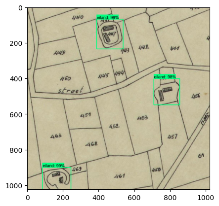

# Eilearn : Detecting Moated Homesteads using machine learning
by Jadd Hallaj

To learn about tensorflow and machine learning: 
https://www.youtube.com/watch?v=yqkISICHH-U&t=775s

Previous research lead by the authors has reveiled the presence of historical moated sites across SouthWest Flanders that constitute a cultural heritage under the threat of extinction due to urban sprawl. By cross referencing historical maps, the authors were able to situate the sites of interest that are today harder to identify in any given map or satellite image.So far, more than 500 sites were identified in Southwest Flanders alone.

Further research was required to determine the extent of the network of moated sites in Northern Europe. This is where machine learning comes in. Instead of manually identifying the sites, the authors are using machine learning to automate the process of detection. Not only should the models detect the site, but also distinguish between it's composing elements: water, housing, trees, and even toponymie.

The priliminary objective of this project is to quantify the sites and their composing elements in order to trace the extent of the Region of Interest in our research into these sites in Northern Europe. The second objective is to understand this distribution and link it to other layers of the territory: geography, topography, waterways, etc. and develop a hypothesis on the reason for the existance of the network in the first place. The final objective is to create a model trained on different layers to detect moates sites anywhere in the world, by passing over the detection in historical maps to satelite imagery.

The following repository contains the code used to train the model to detect the sites. The model is trained using Tensorflow 2.0 and the Tensorflow Object Detection API. The model is trained using the SSD MobileNet architecture. The model is then exported to be used in the detection of moated sites in the region of interest.

## Folder Structure 

- map_layers: contains the image data for the layers to be trained on. 
- <layer_name>: Each sub folder represents layer names. All the images related to that layer are stored in this folder.
    - tiles: the exported XYZ tiles (see step 1)
    - to_label: the images to label. Basically the tiles moved here with a flattened folder structure. The images are renamed to <z>_<x>_<y>.jpg where z, x, and y are the tile coordinates.
    - train: the images used for training. This should represent 80% of the images in the to_label folder. 
    - test: the images used for testing. This should represent 20% of the images in the to_label folder.


## 1. Exporting Tiles

### EILAND Detection

The tiles used for the detection of Islands are extracted from two web mapping services:

- belgium_ign: IGN Map 1873: https://www.ngi.be/tiles/arcgis/rest/services/seamless_carto__default__3857__800/MapServer/tile/%7Bz%7D/%7By%7D/%7Bx%7D
- popp_karte: 	https://geo.api.vlaanderen.be/HISTCART/wmts 
- France: Carte de l'Etat Major (1820-1866): https://wxs.ign.fr/cartes/geoportail/wmts?SERVICE=WMTS&VERSION=1.0.0&REQUEST=GetCapabilities

Tiles are exported using QGIS's "Generate XYZ tiles" function, with a zoom level of 16 and a tile resolution of 1024 \* 1024 pixels, 150 DPI, JPG, 75 quality.

Save the tile to 'images/tiles/<layer_name>' directory. 

Use Higher zoom levels which tend to work much better when compressed and resized by Tensorflow. Use tiles from all across the map to ensure that the model is trained on a variety of different landscapes.

### Move the tiles 

Move the tile from the XYZ Tile directory to the images_to_label directory. This will be used as a staging area for the labeling process. Use the "move_tiles.py" script for this. 


## Label Testing Images

Boxes need to contain full eilands and not small pieces. This will require tiling to be done in a way that ensures that the eiland is fully contained in the tile, but not taking full eilands can lead to roads being mistaken for water. Black and white tiles need to be used fo black on white drawings (remove the color of the paper that can add unwanted noise).

Install labelImg using pip:

```
pip install labelImg
```

enter the labelImg folder and run

```
python labelImg.py
```

Label the images using only one label: "eiland"

to train the model:

```
python Tensorflow\models\research\object_detection\model_main_tf2.py --model_dir=Tensorflow\workspace\models\my_ssd_mobnet --pipeline_config_path=Tensorflow\workspace\models\my_ssd_mobnet\pipeline.config --num_train_steps=6000
```

to evaluate the model:

```
python Tensorflow\models\research\object_detection\model_main_tf2.py --model_dir=Tensorflow\workspace\models\my_ssd_mobnet --pipeline_config_path=Tensorflow\workspace\models\my_ssd_mobnet\pipeline.config --checkpoint_dir=Tensorflow\workspace\models\my_ssd_mobnet
```

### Move the xmls and split between train and test

Move the xmls from the images_to_label directory to the images_to_train directory. This will be used as a staging area for the training process. Use the "move_xml.py" script for this. This isolates the images with labels from the images without labels. Imaged are saved to "map_layers/<layer_name>/labeled"

### Split the images between train and test

Move 80% of the images from the "labeled" directory to the map_layers/<layer_name>/train directory. Move 20% of the images from the "labeled" directory to the map_layers/<layer_name>/test directory. Use the "split_images.py" script for this.

## 2. Training the model



 